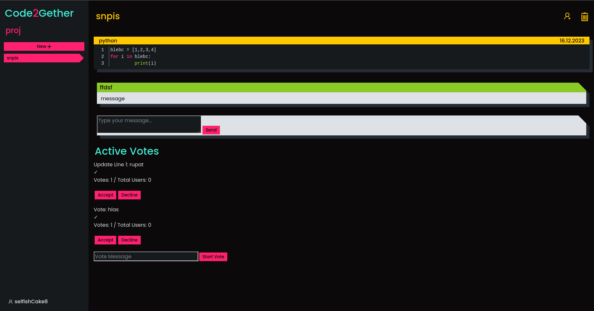

# 🧑‍💻 Collaborative Coding Web App

This project is a web application built with **React (frontend)** and **Python Flask (backend)** that allows users to create collaborative coding sessions with their friends. Within a session, users can:

- 👨‍💻 Code 
- 💬 Use a live chat  
- 📊 Create and vote in polls on code changes  

## 🙌 Authors

- **Matěj Vrba**
- **Ondřej Bahounek**
- **Martin Soukup**

---

## 🚀 Getting Started

### Environment Setup

Use the provided `setup.sh` script to install dependencies. You'll need to have the following installed:

- `npm`
- `pip`
- `python`  
(and possibly other common tools)

```bash
./setup.sh
```
### 🗃️ Database
To initialize the database with test data:

```bash
./init_db.sh
```
To manually run DB tests:
```bash
source backend/venv/bin/activate
python3 backend/init_db.py
deactivate
```

### 🧑‍💻 Running the App
To start the development server:
```bash
npm run dev
```
The web app will be available at:
📍 http://127.0.0.1:5100

